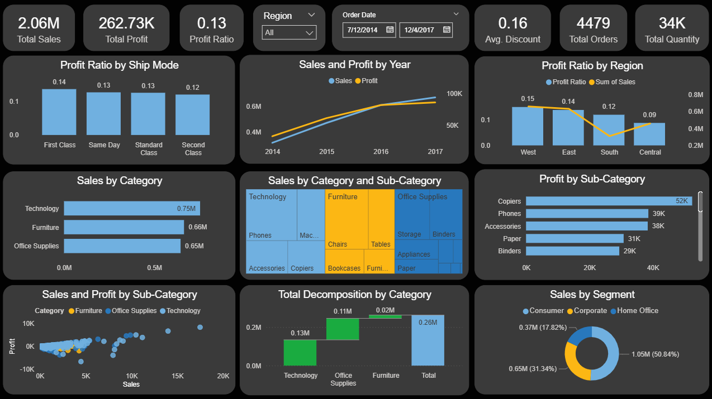

# Superstore Sales Power BI Dashboard

This project focuses on building a Power BI dashboard to analyze business performance across sales, profit, customer segments, regions, and product categories. The goal is to uncover patterns in profitability, operational efficiency, and market distribution using clear, interactive visuals.

## Final Dashboard

## It Includes:
- Total sales, profit, and profit ratio KPIs  
- Breakdown of sales by category and sub-category  
- Profit analysis by region and ship mode  
- Sales distribution across customer segments  
- Year-over-year sales and profit trends  
- Top-performing sub-categories by sales  
- Scatter plot of sales vs. profit for product insights  

## Files Included
- `sales_dashboard.pbix` – Power BI dashboard file  
- `dashboard.png` – Dashboard image  
- `dataset.csv` – Source dataset 

## How to View
1. Download or clone this repository.  
2. Open `sales_dashboard.pbix` in Power BI Desktop.  
3. Explore the visuals and filters to interact with the data.

## About
Created by AkillerKavinda  
This is a hands-on Power BI project built to improve dashboard design, business analytics, and data storytelling skills.
